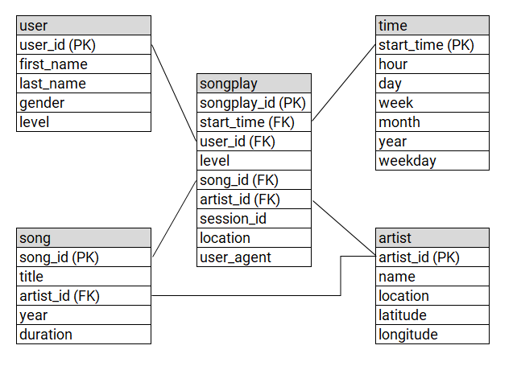

## Introduction
A startup called Sparkify wants to analyze the data they've been collecting on songs and user activity on their new music streaming app. The analytics team is particularly interested in understanding what songs users are listening to. Currently, they don't have an easy way to query their data, which resides in a directory of JSON logs on user activity on the app, as well as a directory with JSON metadata on the songs in their app.

They'd like a data engineer to create a Postgres database with tables designed to optimize queries on song play analysis, and bring you on the project. Your role is to create a database schema and ETL pipeline for this analysis. You'll be able to test your database and ETL pipeline by running queries given to you by the analytics team from Sparkify and compare your results with their expected results.

## How to Run the Python Scripts
The python scripts can be run directly through the terminal. For example, `python sql_queries.py`. For convenience/flow, they can also be run within a Jupyter Notebook cell with `%run filename.py`.

## Files in Repository

*Notebooks* 
etl.ipynb: This is for testing the entire process of reading in, cleaning, then writing the data to a postgres DBprocess
test.ipynb: SQL queries of the DB to verify actions in etl.ipynb have completed (or etl.py)

*Scripts* 
sql_queries.py: String queries to be passed into psycopg2 functions. Dropping/Creating Tables, Inserting/Selecting Data. 
create_tables.py: Creates the DB and reads queries from sql_queries.py to prepare the tables for inserting data
etl.py: Runs sql_queries.py/create_tables.py then reads song/log data and writes to DB. Running this file creates the DB and inserts all data from the data/ directory into the DB.

## Schema Design/Pipeline

The songplay table is our core table with each song play recorded. It has multiple foreign keys corresponding to the "points" in this schema. Information about songs, artists, users, and additional time fields are available to be joined to songplay using additional tables.

To create these tables, the user/song/artist/time table fields are extracted from song and log data and the tables are built separately. The song title and duration and artist name are used to map the song_id/artist_id back to the songplay table for future queries.